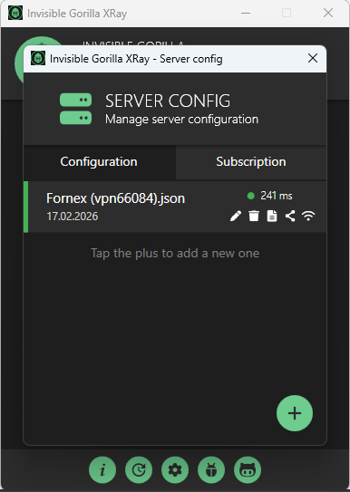

<p align="center">
  
</p>

<h1 align="center">Invisible Gorilla XRay</h1>

<p align="center">
  Free, open-source Xray client for Windows, macOS, Android (experimental), and Linux (GNOME-first)<br>
  powered by <a href="https://github.com/XTLS/Xray-core">Xray-core</a>
</p>

<p align="center">
  <a href="https://github.com/hvkeyn/InvisibleGorilla-XRayClient/releases/latest"></a>
  <a href="./LICENSE.md"></a>
</p>

---

## Download

| Platform | Download | Requirements |
|---|---|---|
| **Windows** | [Latest Release (.exe)](https://github.com/hvkeyn/InvisibleGorilla-XRayClient/releases/latest) | Windows 10+ |
| **macOS** | [Latest Release (.app)](https://github.com/hvkeyn/InvisibleGorilla-XRayClient/releases/latest) | macOS 13+ (Apple Silicon & Intel) |
| **Linux** | Build from source with `./build.sh` | ALT Linux + GNOME first; also supports Debian/Ubuntu, Fedora/RHEL, openSUSE, and Arch families |
| **Android** | Build from source with `.\build-android.ps1` | .NET Android workload, Android SDK, JDK 11+, Android NDK, arm64 device |

## What Is This?

Invisible Gorilla XRay wraps [Xray-core](https://github.com/XTLS/Xray-core) with desktop and mobile clients, shared config management, and platform-specific routing logic.

On Windows and macOS, the project already provides desktop-ready flows. Linux support is available through a GNOME-first Avalonia desktop head that reuses the macOS UI and integrates with Linux desktop services. Android support is present as an experimental Avalonia head with APK packaging groundwork, local proxy workflow, shared config management, and storage/runtime preparation for mobile packaging.

## Current Linux Status

Linux support is **GNOME-first** and build-script driven.

- The repo includes an `InvisibleGorilla-XRay.Linux` project built with Avalonia UI 11 and shared `InvisibleGorilla.Core` logic.
- The Linux head reuses the macOS Avalonia views and adds Linux-specific handlers for proxy, TUN, notifications, startup, deep links, and app rules metadata.
- `./build.sh` is the main Linux entry point. It detects common distro families, installs/fetches required dependencies where possible, builds the Go wrapper as `libXRayCore.so`, downloads `tun2socks` and geo databases, publishes a self-contained Linux GUI, and creates a distributable bundle.
- The generated bundle includes `run-igxray` for direct launch after unpacking, plus `install.sh` for system installation. After install, the app can be launched from the menu or with `invisible-gorilla-xray` / `igxray`.
- GNOME system proxy mode uses `gsettings`; TUN mode uses `tun2socks` with privileged `ip`/DNS steps batched into one `pkexec`/`sudo` call per phase (v3.6.0).
- Linux app-rules support currently persists the shared app-rules contract as a JSON bridge for future kernel-level enforcement.
- **Simply Linux 11.1 / ALT Linux:** see [docs/linux-simply-linux.md](docs/linux-simply-linux.md) for build, install, and one-time polkit setup (no repeated root password prompts).

## Current Android Status

Android support is **experimental**.

- The repo now includes an `InvisibleGorilla-XRay.Android` project that can be packaged as an APK.
- Shared config handling, local Xray listener startup, config import, and Android app-private storage setup are implemented.
- The Android mobile tunnel bridge is **not bundled yet**, so full `VpnService`-backed TUN routing still needs a follow-up native runtime step.
- `proxy mode` on Android currently means a local listener on `127.0.0.1:<port>` rather than desktop-style global system proxy switching.

## What's new in v3.6.10

- **Windows: crash while idle** — background Goida checks no longer call native `XRayCore.dll` when the proxy is disconnected.
- **Windows: lighter idle UI** — the public-IP timer runs only while connected, and dispatcher exceptions no longer kill the app.
- **Windows: faster IP lookup** — disconnected probes reuse one `HttpClient` instead of opening a new connection for every endpoint.

## What's new in v3.6.9

- **Windows hotfix over v3.6.8** — keeps the TUN v0.3.9 routing fix and adds native crash hardening plus stale TUN cleanup after abnormal exits.

## What's new in v3.6.8

- **Windows TUN:** fix traffic not tunneling — resolve the physical default gateway before the virtual adapter is addressed, bind `tun2socks` to the uplink NIC (requires InvisibleGorilla-TUN v0.3.9+).
- **Windows: fixed random `XRayCore.dll` crash** — native `bool` parameters are marshaled correctly for the cgo DLL, removing a likely cause of `0xc0000005` access violations.
- **Windows: TUN cleanup is safer** — shutdown and crash cleanup now disable TUN/routes before stopping native Xray, and startup tries to disable stale TUN state left by an older crashed build.
- **Windows: quieter TUN SOCKS listener** — local TUN SOCKS auth is disabled on localhost to avoid storms of `invalid username or password` from stale system proxy state.

## What's new in v3.6.7

- **Linux: crash on profile select** — `Settings.json` save no longer crashes when the data folder is root-owned; startup tries `pkexec chown` once to repair permissions.
- **Linux: empty VPN server address** — TUN bypass route now reads the server host from the on-disk VLESS config (`settings.vnext[0].address`), not only the native runtime JSON (which often omits it).
- **Linux: pkexec every connect** — `scripts/linux/install-tun-policy.sh` is bundled in the tarball for one-time polkit setup.

## What's new in v3.6.6

- **Linux: TUN no longer aborts on app-rules file permission errors** — `linux-transparent-proxy-config.json` is optional metadata; write failures (e.g. data folder owned by root after `sudo ./run-igxray`) no longer block VLESS/TUN. Startup notifies with `chown` fix command; fallback write to `$XDG_RUNTIME_DIR` or `/tmp`.

## What's new in v3.6.5

- **Linux: fix "Failure processing application bundle"** — `run-igxray` now sets `DOTNET_BUNDLE_EXTRACT_BASE_DIR` to a writable cache (`~/.cache`, bundle folder, or `/tmp`) so single-file .NET can extract on Simply Linux and similar desktops where the default cache path is unavailable.

## What's new in v3.6.4

- **Linux: do not run with sudo** — starting via `sudo ./run-igxray` broke TUN setup (pkexec fails under root), Xray stopped, but the UI stayed on "Running" with `Connection refused (127.0.0.1:10801)`. Privileged `ip`/`resolvectl` commands now run directly when already root; the launcher warns against sudo; tunnel setup errors reset the UI and show a desktop notification.
- **Linux TUN setup validation** — creating the tun interface is now checked; a failed setup aborts with a clear message instead of a half-enabled state.

## What's new in v3.6.3

- **Fixed Linux/macOS routing loop (socket storm / OOM)** — the VPN server now always keeps a direct, non-TUN route. The server address is resolved to its IP (Reality configs can use a hostname) and pinned to the real uplink before the TUN default routes are installed. Previously, if the bypass route was skipped, xray's own outbound to the server re-entered the tunnel and looped, spawning thousands of sockets (`too many open files` → `Out of memory`). If a safe bypass can't be set up, the client now refuses to enable TUN with a clear error instead of looping.
- **Connection info reliability on Linux** — with the loop gone, the local SOCKS listener no longer gets exhausted, so the live IP/location check stops failing with `Cannot assign requested address`.
- **Windows first-launch fix** — the wait for the local proxy listener was raised from 5s to 15s so a slow first start (on-access AV scanning the freshly extracted build) no longer surfaces as `The application can't tunnel the system`.

## What's new in v3.6.2

- **Connection info shows full data over the tunnel** — geo-capable lookups (`ipinfo.io`, `ipwho.is`) are queried first so Location/Provider populate instead of just a bare IP (Android/Linux/macOS); IP-only services stay as a last-resort fallback.
- **Windows layout fix** — the main window content is vertically balanced; the status icon no longer slips under the header and the connection card is pinned to the bottom.
- **Steadier probing** — lookups remain serialized (one at a time) with the post-connect grace period, so there is no request storm right after connect.

## What's new in v3.6.1

- **Linux TUN:** batched `pkexec`/`sudo` (1–2 prompts per connect/disconnect); optional polkit rule (`scripts/linux/install-tun-policy.sh`).
- **Linux app rules:** async app list, no freeze on template rename; saving rules does not reconnect VPN.
- **Simply Linux 11.1 guide:** [docs/linux-simply-linux.md](docs/linux-simply-linux.md).
- **Release hygiene:** Linux/Windows publish bundles strip `Settings.json`, `Configs/`, `Logs/`, Goida caches before packaging.

## What's new in v3.6.0

- **Linux TUN: one pkexec per phase** — `ip`/`resolvectl` commands are batched; connect/disconnect needs 1–2 password prompts instead of ~10 (optional polkit rule for zero prompts: [Simply Linux guide](docs/linux-simply-linux.md)).
- **Linux app rules UI** — app list loads in background; renaming templates no longer freezes the window; saving rules does not force VPN reconnect on Linux.
- **Connection info hardening** — tunnel stays up when external IP-check services fail.
- **Android Goida / connection info** — tunnel failover, live IP checks, safer virtualized node list.
- **Windows build/publish** — user runtime data stripped from release output; auto-install GCC (w64devkit) and download progress in `build.ps1`.

## What's new in v3.5.9

- **Per-connection app rules (Windows)** - the App rules dialog now has an *"Apply rules to connection"* selector, so you can assign a template and routing mode to any server config (active or not), then switch between them like VLESS keys.
- **Cleaner app picker (Windows)** - running apps are listed by their friendly product name instead of the current window title (no more giant browser-tab headings), the dialog is resizable, and the app list is taller and easier to scan.
- **Tor bridge profiles (Android)** - paste a bridge key to create a switchable Tor profile in the server list, check its availability/latency, and see it on the main screen (from v3.5.8).
- **Faster bridge fetch + fallback** - bridge requests time out in 20s and fall back to built-in obfs4 bridges when the bridge service is unreachable (from v3.5.8).
- **Analytics removed** - the client never transmits usage data, and the "Send analytics" checkbox is gone on all platforms (from v3.5.8).

## Features

- **One-click connect** on desktop - import config and press Run
- **VLESS, VMess, Trojan, Shadowsocks** - all major protocols supported
- **Tor support** - route over the Tor network with built-in or custom obfs4 bridges (Orbot-style); Android exposes Tor bridges as switchable profiles
- **Proxy and TUN modes** - Windows/macOS desktop routing, Linux GNOME proxy + TUN support, Android groundwork for local proxy and future mobile VPN
- **Per-connection app rules** - choose all-apps / bypass-selected / only-selected routing per server config with reusable templates (Windows)
- **Server management** - add, test, switch between multiple servers
- **Connection testing** - check latency with one click
- **Subscription support** - auto-update server lists from provider links
- **Shared core logic** - common config, templates, and Xray wrapper integration across platforms
- **Privacy-first** - no analytics or telemetry; nothing is sent anywhere
- **Diagnostic logging** - startup/runtime troubleshooting for both desktop and mobile app roots

## Screenshots

<p align="center">
  
  &nbsp;&nbsp;
  
</p>

## Quick Start

### 1. Download or build

- Windows and macOS: use the latest release from the [Releases page](https://github.com/hvkeyn/InvisibleGorilla-XRayClient/releases/latest).
- Linux: build from source with `./build.sh`, then run `dist-linux/<rid>/InvisibleGorilla-XRay-<rid>/run-igxray` or install the generated bundle.
- Android: build the APK from source with `.\build-android.ps1`.

### 2. Add a server

Open the app, import a raw JSON config, config link, or subscription, then select the config you want to run.

### 3. Connect

- Desktop: choose your mode and click **Run**.
- Linux: use Proxy mode on GNOME for `gsettings`-based system proxy, or TUN mode for full-route tunneling through bundled `tun2socks`.
- Android: use the experimental Android head to manage configs and start the local proxy workflow while the mobile tunnel bridge is being finalized.

## Build from Source

<details>
<summary><b>Windows</b></summary>

```powershell
git clone https://github.com/hvkeyn/InvisibleGorilla-XRayClient.git
cd InvisibleGorilla-XRayClient
.\build.ps1
```

The script auto-installs Go, GCC, and .NET 7 SDK if missing, then builds everything for Windows.

| Command | Description |
|---|---|
| `.\build.ps1` | Full Windows build |
| `.\build.ps1 -Publish` | Build + single-file executable |
| `.\build.ps1 -Step GoWrapper` | Only build `XRayCore.dll` |
| `.\build.ps1 -Step DotNet` | Only build the .NET desktop app |

</details>

<details>
<summary><b>macOS</b></summary>

```bash
git clone https://github.com/hvkeyn/InvisibleGorilla-XRayClient.git
cd InvisibleGorilla-XRayClient
chmod +x build-macos.sh
./build-macos.sh
```

Tested on macOS Sequoia 15.7+ (Apple Silicon and Intel). Builds an `.app` bundle with Avalonia UI.

The raw publish output is written to `publish-macos/<rid>/`. The runnable bundle is written to `dist-macos/<rid>/` and contains `InvisibleGorilla-XRay.app`, `run-igxray`, `README-MACOS.txt`, and a `.tar.gz` archive. The internal executable is `dist-macos/<rid>/InvisibleGorilla-XRay.app/Contents/MacOS/InvisibleGorilla-XRay.Mac`.

| Command | Description |
|---|---|
| `./build-macos.sh` | Full macOS build |
| `./build-macos.sh --runtime osx-arm64` | Build Apple Silicon output |
| `./build-macos.sh --runtime osx-x64` | Build Intel output |
| `./build-macos.sh --step go` | Only build `XRayCore.dylib` |
| `./build-macos.sh --step bundle` | Only package the `.app` bundle |

</details>

<details>
<summary><b>Linux</b></summary>

```bash
git clone https://github.com/hvkeyn/InvisibleGorilla-XRayClient.git
cd InvisibleGorilla-XRayClient
chmod +x build.sh
./build.sh
```

The Linux build targets ALT Linux + GNOME first, but the script also covers Debian/Ubuntu, Fedora/RHEL, openSUSE, and Arch package families. It publishes `InvisibleGorilla-XRay.Linux` for `linux-x64` or `linux-arm64` and bundles runtime files into `dist-linux/<rid>/`.

After a successful build:

```bash
cd dist-linux/linux-x64/InvisibleGorilla-XRay-linux-x64
./run-igxray
```

For system installation:

```bash
./install.sh
invisible-gorilla-xray
# or
igxray
```

| Command | Description |
|---|---|
| `./build.sh` | Full Linux build + distributable bundle |
| `./build.sh --runtime linux-arm64` | Build for Linux ARM64 |
| `./build.sh --skip-deps` | Skip system package installation |
| `./build.sh --step go` | Only build `Libraries/libXRayCore.so` |
| `./build.sh --step tun2socks` | Only fetch bundled `tun2socks` |
| `./build.sh --step dotnet` | Only publish the Avalonia Linux GUI |
| `./build.sh --step bundle` | Only create the `dist-linux/<rid>/` bundle |

</details>

<details>
<summary><b>Android</b></summary>

### Prerequisites

On Windows, `.\build-android.ps1` now installs missing prerequisites automatically on first run. That includes:

- .NET 8 SDK
- .NET Android workload
- JDK 17
- Android command-line tools
- Android SDK platform/build-tools
- Android NDK
- Go 1.23

You still need a working internet connection, and some installers may request elevation depending on local system policy.

### Build

```powershell
git clone https://github.com/hvkeyn/InvisibleGorilla-XRayClient.git
cd InvisibleGorilla-XRayClient
.\build-android.ps1
```

The Android build script:

- checks for missing build dependencies and installs them automatically when possible
- downloads `geoip.dat` and `geosite.dat` into `InvisibleGorilla-XRay.Android/Assets/Runtime`
- builds the Android native bridge from `XRay-Wrapper` using the Android NDK and packages it into runtime assets
- publishes `InvisibleGorilla-XRay.Android` as an APK

| Command | Description |
|---|---|
| `.\build-android.ps1` | Full Android build + APK publish |
| `.\build-android.ps1 -SkipNativeBridge` | Reuse the existing Android native bridge runtime asset in `Assets/Runtime` |
| `.\build-android.ps1 -SkipGeoFiles` | Reuse existing geo files in `Assets/Runtime` |
| `.\build-android.ps1 -NoPublish` | Prepare runtime assets without publishing the APK |
| `.\build-android.ps1 -KeystorePath <path> -KeyAlias <alias>` | Publish a signed APK using `ANDROID_SIGNING_PASSWORD` |

</details>

## Architecture

| Component | Technology | Platform |
|---|---|---|
| Windows GUI | WPF (.NET 7, C#) | Windows |
| macOS GUI | Avalonia UI 11 (.NET 7, C#) | macOS |
| Linux GUI | Avalonia UI 11 (.NET 7, C#) | Linux |
| Android GUI | Avalonia UI 11 (.NET 8 Android, C#) | Android |
| Shared logic | `InvisibleGorilla.Core` (.NET class library) | Cross-platform |
| Proxy engine | [Xray-core](https://github.com/XTLS/Xray-core) v25.1.30 | Cross-platform |
| Native bridge | Go 1.23 -> cgo shared library (`.dll` / `.dylib` / `.so`) | Windows / macOS / Linux / Android |
| Windows tunnel service | [InvisibleGorilla-TUN](https://github.com/hvkeyn/InvisibleGorilla-TUN) | Windows only |
| Linux tunnel layer | `tun2socks`, `iproute2`, `pkexec` / `sudo`, GNOME `gsettings` proxy integration | Linux |
| Android mobile VPN layer | `VpnService` groundwork in Android head | Android |
| Geo routing | [v2fly geoip](https://github.com/v2fly/geoip) + [domain-list](https://github.com/v2fly/domain-list-community) | Cross-platform |

## Troubleshooting

| Problem | Solution |
|---|---|
| App shows "Running" but traffic does not change on desktop | Check `diagnostic.log` in the app folder. Try a different server or protocol. |
| Linux archive was unpacked but the executable is hard to find | Run `./run-igxray` from the unpacked bundle root, or run `./install.sh` and then start `invisible-gorilla-xray` / `igxray`. |
| Linux TUN mode cannot start | Make sure `pkexec` or passwordless/current-user `sudo` can run privileged `ip`/DNS commands. The app fails closed if TUN setup is denied. |
| Linux proxy mode does nothing | GNOME proxy mode depends on `gsettings org.gnome.system.proxy`; on non-GNOME desktops it may no-op while TUN mode remains available. |
| Android proxy mode starts but apps do not route automatically | Android currently starts a local listener; point apps to `127.0.0.1:<proxy-port>` or wait for the follow-up mobile tunnel bridge. |
| Android TUN mode reports an error | This repository now contains the Android groundwork, but the native mobile tunnel bridge is still a follow-up task. |
| Android native bridge asset is missing during packaging | Run `.\build-android.ps1` with a valid `ANDROID_NDK_ROOT` so the wrapper can build and package the Android shared library runtime asset. |
| `dotnet publish` cannot find Android SDK | Set `ANDROID_SDK_ROOT` or `ANDROID_HOME`, or pass `-AndroidSdkDirectory` to `.\build-android.ps1`. |
| Desktop proxy stays on after a crash | Restart the app - it cleans up stale proxy settings on startup/shutdown. |

## Contributing

- **Report bugs** - open an [issue](https://github.com/hvkeyn/InvisibleGorilla-XRayClient/issues)
- **Add a language** - see [Language.md](./Language.md)
- **Submit code** - fork, branch, and send a pull request

## License

[MIT](./LICENSE.md)

## Credits

- [InvisibleMan-XRay](https://github.com/InvisibleManVPN/InvisibleMan-XRay) - original project
- [Xray-core](https://github.com/XTLS/Xray-core) - proxy engine
- [InvisibleGorilla-TUN](https://github.com/hvkeyn/InvisibleGorilla-TUN) - Windows tunnel companion service
